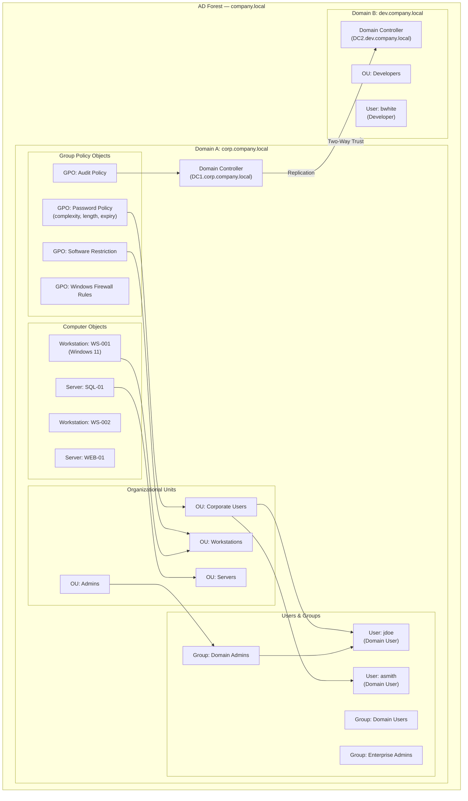

# Active Directory — Domain Controller, Users, Groups, OUs, GPOs, Trusts

Active Directory (AD) is Microsoft's directory service for Windows domain networks, providing centralized authentication, authorization, and management. **Domain Controller (DC)**: The DC is a server running Active Directory Domain Services (AD DS) that authenticates users, stores directory data, and replicates changes to other DCs. Every AD domain requires at least one DC. **Organizational Units (OUs)**: OUs are containers within a domain that organize users, groups, and computers into a logical hierarchy. They are the smallest scope for applying Group Policy and delegating administrative control. **Users and Groups**: User objects represent people or service accounts. Security groups (Domain Admins, Domain Users, Enterprise Admins) simplify permission assignment. Domain Admins have full control over the domain, while Enterprise Admins extend that across the entire forest. **Group Policy Objects (GPOs)**: GPOs are collections of policy settings applied to OUs, sites, or domains. They enforce security baselines like password complexity, account lockout, software restrictions, and audit policies. GPOs are processed in a specific order: Local, Site, Domain, OU (LSDOU), with later policies overriding earlier ones. **Trust Relationships**: Trusts allow users in one domain to access resources in another. A two-way transitive trust is automatically created between domains in the same forest. External trusts, forest trusts, and shortcut trusts provide cross-forest or cross-domain access. AD relies on Kerberos for authentication, LDAP for directory queries, and DNS for service location.
