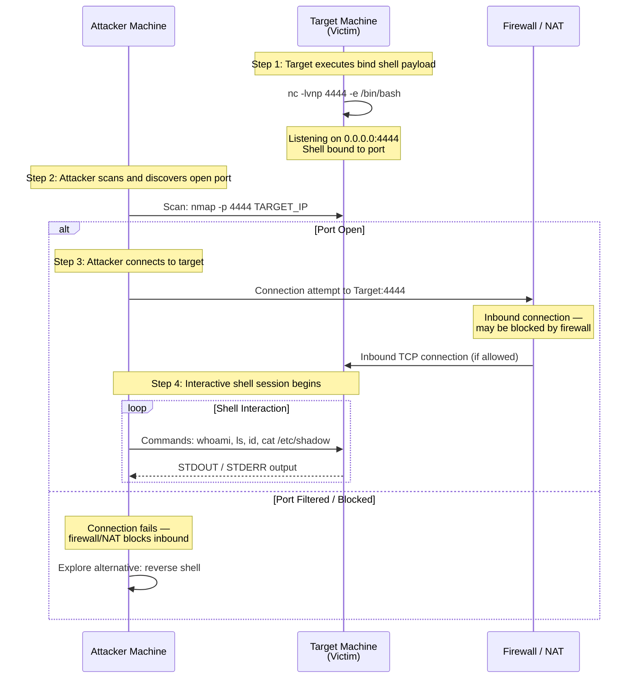

# Bind Shell — Target Opens Port, Attacker Connects In

A bind shell works oppositely to a reverse shell: the target machine opens a TCP port and listens for an incoming connection from the attacker. **Step 1 — Target Listens**: The victim machine executes a bind shell payload, often via Netcat (`nc -lvnp 4444 -e /bin/bash`), which opens port 4444 and binds a shell process to it. Every incoming connection on that port gets attached to the shell's standard input, output, and error streams. On Windows, similar functionality exists using `powercat` or `ncat`. **Step 2 — Reconnaissance**: The attacker scans the target's IP address to discover the open port using tools like Nmap (`nmap -p 4444 <target>`). If the port appears as "open", the bind shell is ready for connection. **Step 3 — Attacker Connects**: The attacker uses Netcat (`nc <target_ip> 4444`) to connect to the listening port on the target. If a firewall or NAT exists between them, this inbound connection may be blocked, resulting in a "filtered" or "closed" port state. **Step 4 — Shell Interaction**: Once the TCP connection is established, the attacker can send commands and receive output interactively. The shell runs with the privileges of the user that started the bind shell process. **Limitations**: Bind shells are less reliable than reverse shells in modern engagements because most networks block inbound connections at the perimeter firewall. Additionally, the attacker needs to know the target's IP address and the open port, and the bind shell process must survive on the target without being detected by antivirus or intrusion detection systems.
