# Cryptography Overview — Symmetric vs Asymmetric, Hashing, Signing

```mermaid
graph TB
    subgraph Symmetric["Symmetric Encryption"]
        SymKey["Shared Secret Key<br/>(Same key for encrypt & decrypt)"]
        SymEnc["Encryption: AES, ChaCha20, DES, 3DES"]
        SymDec["Decryption: reverse algorithm with same key"]
        SymEx["Example: AES-256-GCM<br/>Used for bulk data encryption"]
    end

    subgraph Asymmetric["Asymmetric Encryption (Public Key)"]
        AsymKeys["Key Pair: Public Key + Private Key"]
        AsymEnc["Encrypt with Public Key<br/>Decrypt with Private Key"]
        AsymSign["Digital Signature:<br/>Sign with Private Key<br/>Verify with Public Key"]
        AsymEx["Example: RSA, ECC, ECDSA, Ed25519"]
    end

    subgraph Hash["Hashing (One-Way)"]
        HashIn["Input: any-length data"]
        HashFunc["Hash Function: SHA-256, SHA-3, MD5 (broken)"]
        HashOut["Output: fixed-length digest (hash)"]
        HashProp["Properties:<br/>1. Deterministic<br/>2. Preimage resistance<br/>3. Collision resistance"]
        HashUse["Usage: password storage, integrity checks, digital signatures"]
    end

    subgraph HMAC["HMAC (Hash-Based MAC)"]
        HMACKey["Key + Message → HMAC"]
        HMACFunc["HMAC-SHA256, HMAC-SHA1"]
        HMACUse["Message authentication & integrity<br/>Used in TLS, JWT, API auth"]
    end

    subgraph TLSFlow["Typical TLS Hybrid Flow"]
        TLS1["Client generates session key"]
        TLS2["Encrypt session key with server's public key (asymmetric)"]
        TLS3["Both sides encrypt data with session key (symmetric AES)"]
        TLS4["Message integrity: HMAC or AEAD (GCM)"]
    end

    Symmetric --- SymKey
    Asymmetric --- AsymKeys
    Hash --- HashProp
    TLSFlow --> TLS1

    style Symmetric fill:#1a5276,color:#fff
    style Asymmetric fill:#117a65,color:#fff
    style Hash fill:#7d3c98,color:#fff
    style HMAC fill:#b7950b,color:#fff
    style TLSFlow fill:#c0392b,color:#fff
```

Cryptography is the foundation of modern cybersecurity, providing confidentiality, integrity, authentication, and non-repudiation through four core mechanisms. **Symmetric Encryption** uses a single shared secret key for both encryption and decryption. Algorithms like AES (Advanced Encryption Standard) and ChaCha20 are fast and suitable for bulk data encryption. The challenge lies in secure key distribution — both parties must share the same key without interception. **Asymmetric Encryption** solves the key distribution problem using a mathematically linked key pair: a public key (shared openly) and a private key (kept secret). Data encrypted with the public key can only be decrypted with the corresponding private key. RSA and Elliptic Curve Cryptography (ECC) are widely used. Asymmetric cryptography is computationally expensive, so it is typically used to encrypt symmetric session keys (hybrid cryptosystem). **Digital Signatures** invert the asymmetric model: the sender signs a hash of the message with their private key, and the recipient verifies the signature using the sender's public key. This provides authentication and non-repudiation. **Hashing** is a one-way function that produces a fixed-size digest from arbitrary input. SHA-256 is the standard for integrity verification. **HMAC** (Hash-based Message Authentication Code) combines a secret key with hashing to provide both integrity and authentication. In practice, TLS uses a hybrid approach: asymmetric encryption for key exchange, symmetric encryption (AES) for bulk data, and HMAC or AEAD modes for integrity.
