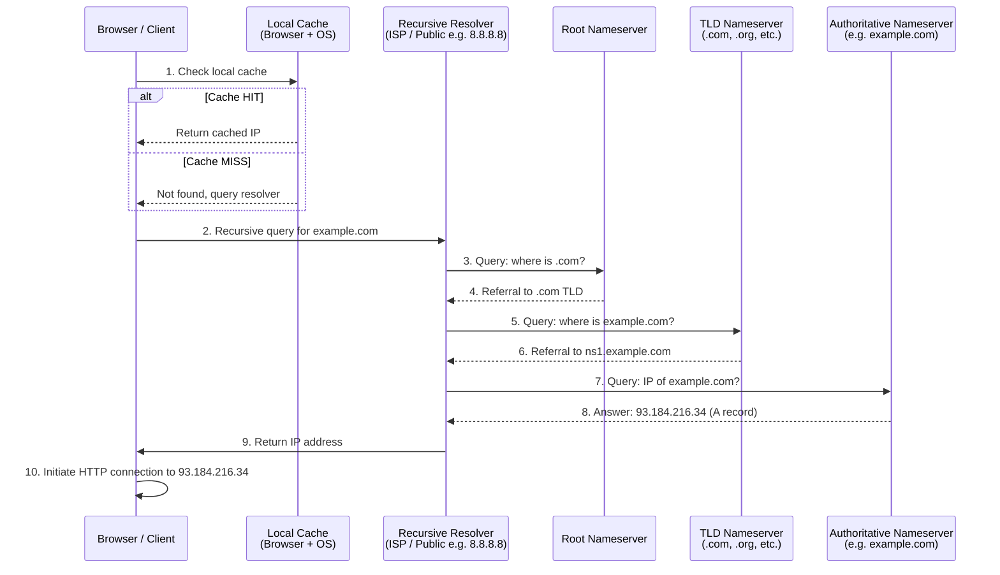

# DNS Resolution Flow — From Browser to Authoritative Nameserver

The DNS resolution process translates human-readable domain names like `example.com` into machine-readable IP addresses. The flow begins when a user types a URL into their browser. **Step 1 — Local Cache Check**: The browser first checks its own cache, then the OS-level cache (via `nscd` or similar), and sometimes the router's DNS cache. If a cached record exists with a valid TTL, resolution ends immediately. **Step 2 — Recursive Query**: On a cache miss, the browser delegates the query to a recursive DNS resolver, usually operated by the ISP or a public resolver like Google (8.8.8.8) or Cloudflare (1.1.1.1). **Step 3-4 — Root Nameserver**: The resolver queries a root nameserver, which does not know the IP but replies with a referral to the appropriate TLD nameserver (e.g., `.com`). **Step 5-6 — TLD Nameserver**: The resolver then queries the TLD nameserver, which responds with a referral to the domain's authoritative nameserver (e.g., `ns1.example.com`). **Step 7-8 — Authoritative Nameserver**: Finally, the resolver queries the authoritative nameserver, which returns the actual A or AAAA record containing the IP address. **Step 9-10**: The resolver caches the result and returns the IP to the browser, which then initiates a TCP connection and HTTP request to that IP. DNS uses UDP port 53 by default and leverages a hierarchical, distributed database to prevent any single point of failure.
