# Systematic Enumeration Workflow — Network to Vulnerabilities

```mermaid
graph TB
    subgraph Network["1. Network Enumeration"]
        N1["Discover live hosts: ping sweep (nmap -sn)"]
        N2["Discover subnet & topology: traceroute, whois"]
        N3["Identify domain & DNS records: dig, nslookup, dnsrecon"]
    end

    subgraph Ports["2. Port Scanning"]
        P1["Full TCP port scan: nmap -p- -T4 &lt;target&gt;"]
        P2["Service version detection: nmap -sV"]
        P3["OS fingerprinting: nmap -O"]
        P4["Default script scan: nmap -sC"]
    end

    subgraph Services["3. Service Enumeration"]
        S1["Web: dirb, gobuster, nikto, whatweb"]
        S2["SMB: smbclient, enum4linux, smbmap"]
        S3["SSH: ssh-audit, brute force"]
        S4["FTP: anonymous login check, file listing"]
        S5["DNS: zone transfer, subdomain enumeration"]
        S6["SNMP: snmpwalk, onesixtyone"]
        S7["SMTP: VRFY, EXPN, user enumeration"]
        S8["LDAP: ldapsearch, windapsearch"]
    end

    subgraph OS["4. OS & Environment"]
        O1["Windows vs Linux detection (TTL, nmap -O)"]
        O2["Version-specific vulnerabilities (searchsploit)"]
        O3["Patch level: available exploits for outdated software"]
    end

    subgraph Users["5. User Enumeration"]
        U1["Linux: /etc/passwd, /etc/shadow (if readable)"]
        U2["Windows: net users, net localgroup, PowerView"]
        U3["Email harvesting: theHarvester, hunter.io"]
    end

    subgraph Vulns["6. Vulnerability Identification"]
        V1["Automated scanners: nmap vuln script, nessus, openvas"]
        V2["Manual: searchsploit, exploit-db, CVE lookup"]
        V3["Check misconfigs: default creds, weak perms, open shares"]
    end

    subgraph Exploit["7. Exploitation Preparation"]
        E1["Prioritize high-confidence, high-impact vulnerabilities"]
        E2["Select appropriate exploit & payload"]
        E3["Tune evasion: encoding, obfuscation"]
    end

    Network --> Ports --> Services --> OS --> Users --> Vulns --> Exploit

    style Network fill:#1a1a2e,color:#fff
    style Ports fill:#16213e,color:#fff
    style Services fill:#0f3460,color:#fff
    style Vulns fill:#533483,color:#fff
    style Exploit fill:#e94560,color:#fff
```

Enumeration is the most critical phase of penetration testing — the process of systematically extracting information from a target to build an attack surface map. **Phase 1 — Network Enumeration**: Start broad by identifying live hosts on the target network using ICMP ping sweeps (`nmap -sn`), understanding the network topology via traceroute, and extracting DNS records and subdomains. **Phase 2 — Port Scanning**: Perform a full TCP port scan to identify every open port, then follow up with service version detection (`nmap -sV`), OS fingerprinting (`nmap -O`), and default NSE scripts (`nmap -sC`). **Phase 3 — Service Enumeration**: Each open port represents a potential attack vector. Web services get directory brute-forcing (gobuster), vulnerability scanning (nikto), and technology fingerprinting (whatweb). SMB shares are enumerated with enum4linux and smbmap. DNS, SNMP, SMTP, and LDAP services each have specialized enumeration tools. **Phase 4 — OS Detection**: Determine whether the target runs Windows or Linux through TTL analysis and Nmap OS detection, then research version-specific vulnerabilities. **Phase 5 — User Enumeration**: Extract valid usernames from system files, email harvesting tools, or protocol-specific techniques (e.g., SMTP VRFY, RID cycling). **Phase 6 — Vulnerability Identification**: Combine automated scanning with manual research using searchsploit and CVE databases to identify known vulnerabilities and configuration weaknesses. **Phase 7 — Exploitation Prep**: Prioritize the most promising vulnerabilities and prepare the exploit, adjusting payloads for evasion if needed. The key principle is: never stop enumerating — deeper enumeration always reveals more attack surface.
