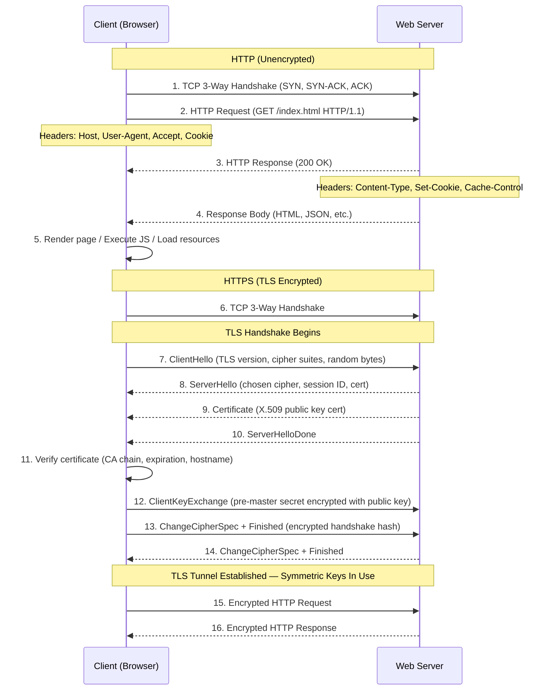

# HTTP Request/Response Cycle and HTTPS/TLS Handshake

The HTTP protocol follows a simple request-response model between a client (browser) and a server. In standard **HTTP**, after the TCP three-way handshake completes, the client sends an HTTP request containing a method (GET, POST, etc.), a URI, headers, and optionally a body. The server processes the request and responds with a status line (e.g., 200 OK, 404 Not Found), headers, and the requested content. The connection may be kept alive for subsequent requests (HTTP/1.1 Keep-Alive) or multiplexed (HTTP/2). **HTTPS** adds the TLS (Transport Layer Security) layer on top of TCP. The TLS handshake begins with the **ClientHello**, where the browser advertises supported TLS versions and cipher suites. The server responds with a **ServerHello** choosing the strongest common cipher, plus its X.509 digital certificate containing the public key. The client validates the certificate against a trusted Certificate Authority (CA) chain, checks expiration, and verifies the hostname. The client then generates a pre-master secret, encrypts it with the server's public key, and sends it back. Both sides derive symmetric session keys from this secret. **ChangeCipherSpec** messages signal the switch to encrypted communication, and the handshake is verified with an encrypted Finished message. All subsequent HTTP data is encrypted with the symmetric session keys, providing confidentiality, integrity, and server authentication.
