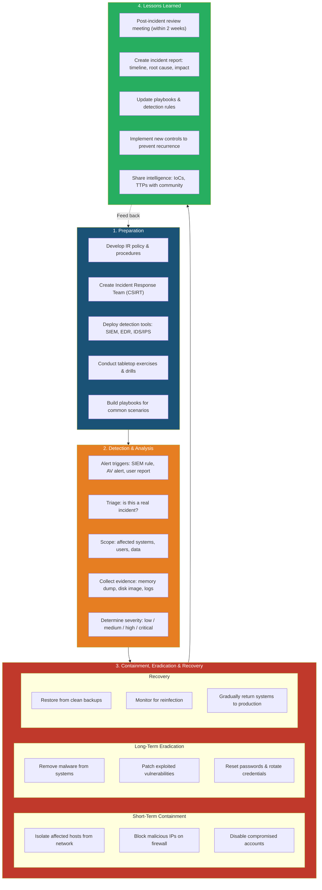

# NIST Incident Response Lifecycle — Preparation Through Lessons Learned

The NIST SP 800-61 Incident Response Lifecycle provides a structured framework for handling security incidents effectively. **Phase 1 — Preparation**: This is the most critical phase. The organization must have a written IR policy, a trained Computer Security Incident Response Team (CSIRT), deployed detection tools (SIEM, EDR, IDS/IPS), and tested playbooks. Preparation also includes hardening systems, backup strategies, and user awareness training. Without preparation, incident response becomes chaotic and ineffective. **Phase 2 — Detection & Analysis**: Incidents are detected through automated alerts or manual reports. The IR team triages alerts to distinguish true incidents from false positives, determines the scope (what systems, users, and data are affected), and collects forensic evidence (memory captures, disk images, network logs) while preserving chain of custody. Severity is assigned based on data sensitivity, business impact, and regulatory obligations. **Phase 3 — Containment, Eradication & Recovery**: Short-term containment stops the bleeding — isolating hosts, blocking IPs, and disabling accounts. Long-term eradication removes the root cause — deleting malware, patching vulnerabilities, and rotating credentials. Recovery involves restoring systems from clean backups and monitoring for signs of reinfection before returning to production. **Phase 4 — Lessons Learned**: Within two weeks of closure, the team conducts a post-incident review to document what happened, what worked, and what failed. The output feeds back into the Preparation phase, creating a continuous improvement loop. Sharing indicators of compromise (IoCs) with industry peers strengthens collective defense.
