# Linux Filesystem Hierarchy — Directory Structure Overview

```mermaid
graph TB
    ROOT["/ (Root)"]
    BIN["/bin<br/>Essential user binaries<br/>ls, cp, mv, cat, bash"]
    SBIN["/sbin<br/>System binaries<br/>fdisk, mkfs, mount, shutdown"]
    ETC["/etc<br/>Configuration files<br/>passwd, shadow, fstab, ssh/"]
    HOME["/home<br/>User home directories<br/>/home/alice, /home/bob"]
    VAR["/var<br/>Variable data<br/>logs (/var/log), spool, tmp"]
    USR["/usr<br/>User system resources<br/>bin/, lib/, share/, local/"]
    TMP["/tmp<br/>Temporary files<br/>cleared on reboot"]
    BOOT["/boot<br/>Boot loader files<br/>vmlinuz, initrd, grub/"]
    DEV["/dev<br/>Device files<br/>sda, tty, null, random"]
    PROC["/proc<br/>Process & kernel info<br/>virtual filesystem (in-memory)"]
    OPT["/opt<br/>Optional add-on software<br/>third-party packages"]
    MNT["/mnt<br/>Temporary mount points"]
    MEDIA["/media<br/>Removable media<br/>USB drives, CD-ROM"]
    LIB["/lib<br/>Shared libraries<br/>libc.so, ld-linux.so"]
    RUN["/run<br/>Runtime variable data<br/>PID files, sockets"]

    ROOT --> BIN
    ROOT --> SBIN
    ROOT --> ETC
    ROOT --> HOME
    ROOT --> VAR
    ROOT --> USR
    ROOT --> TMP
    ROOT --> BOOT
    ROOT --> DEV
    ROOT --> PROC
    ROOT --> OPT
    ROOT --> MNT
    ROOT --> MEDIA
    ROOT --> LIB
    ROOT --> RUN

    VAR --> LOG["/var/log<br/>System logs: syslog, auth.log"]
    VAR --> SPOOL["/var/spool<br/>Print/cron spools"]
    USR --> USRBIN["/usr/bin<br/>Non-essential user binaries"]
    USR --> USRLIB["/usr/lib<br/>Libraries for /usr/bin"]
    USR --> USRLOCAL["/usr/local<br/>Locally compiled software"]
    USR --> SHARE["/usr/share<br/>Arch-independent data<br/>man pages, icons"]
```

The Linux Filesystem Hierarchy Standard (FHS) defines the directory structure that organizes all files on a Linux system. **/** (root) is the top-level directory from which everything descends. **/bin** contains essential command binaries needed for booting and repair (ls, cp, mv, bash). **/sbin** holds system administration binaries (fdisk, mkfs, mount) required for system maintenance. **/etc** is the nerve center for system-wide configuration files in plain text — user databases (passwd, shadow), network settings, SSH configurations, and service configs all live here. **/home** contains personal directories for each user, storing their documents, settings, and local configs. **/var** holds variable data that changes as the system runs — log files under /var/log, print spools, mail queues, and temporary files that must persist across reboots. **/usr** is the largest directory, containing read-only user data shared across multiple hosts: binaries (/usr/bin), libraries (/usr/lib), documentation (/usr/share/man), and locally compiled software (/usr/local). **/tmp** provides world-writable temporary storage that is typically cleared on each reboot. **/dev** contains device files representing hardware components (sda for disks, tty for terminals). **/proc** is a virtual filesystem exposing kernel and process data in real time. **/boot** holds the Linux kernel (vmlinuz), initial ramdisk (initrd), and GRUB bootloader configuration.
