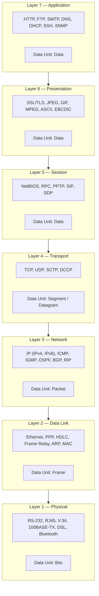

# OSI Model — 7 Layers with Protocols and Data Units

The OSI (Open Systems Interconnection) model is a conceptual framework used to understand network communication across seven distinct layers. Each layer serves a specific function and communicates with its peer layer on the remote host. **Layer 7 (Application)** provides network services directly to end-user applications and includes protocols like HTTP and DNS. **Layer 6 (Presentation)** handles data translation, encryption, and compression through formats like SSL/TLS and JPEG. **Layer 5 (Session)** manages sessions, dialogues, and checkpoints between applications using protocols such as RPC and NetBIOS. **Layer 4 (Transport)** ensures reliable or unreliable delivery of data segments via TCP or UDP respectively. **Layer 3 (Network)** handles logical addressing and routing of packets across networks using IP and routing protocols like OSPF and BGP. **Layer 2 (Data Link)** provides node-to-node data transfer and error detection using MAC addresses and Ethernet frames. **Layer 1 (Physical)** transmits raw bit streams over physical media like copper wire, fiber optics, or radio waves. Data flows down through the layers on the sender side and back up on the receiver side, with each layer adding its own header information in a process called encapsulation.
