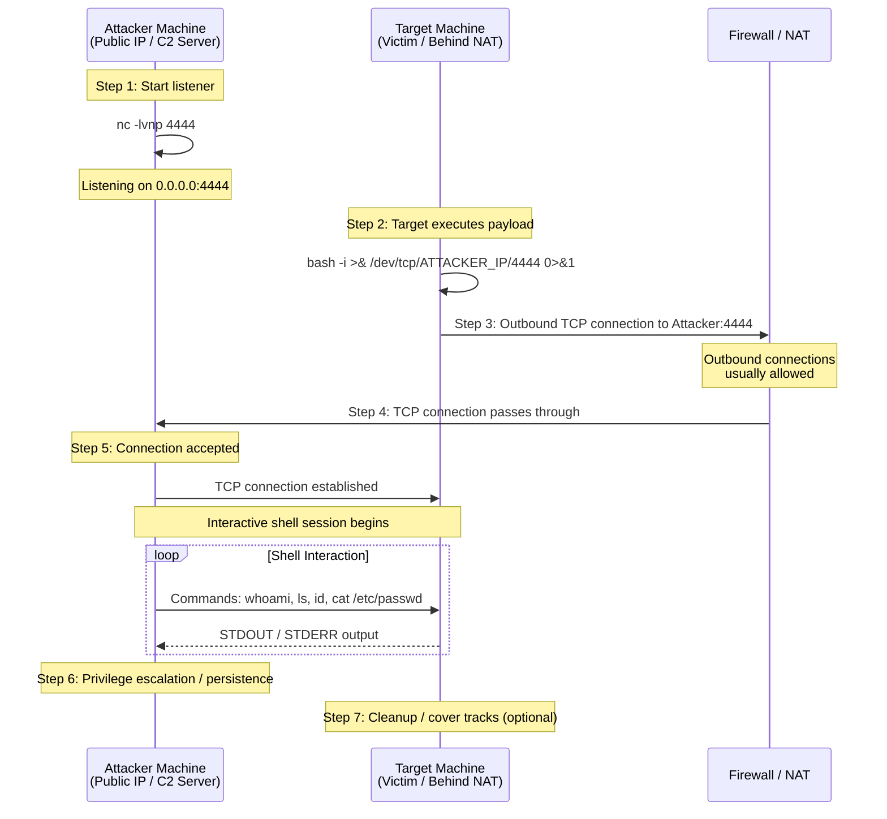

# Reverse Shell — Attacker Listener, Target Connects Back

A reverse shell is a technique where the target machine initiates an outbound connection back to the attacker's machine, bypassing firewalls and NAT rules that typically block inbound connections. **Step 1 — Listener Setup**: The attacker sets up a listener on their machine using a tool like Netcat (`nc -lvnp 4444`) or Metasploit's multi/handler. This listener binds to a port and waits for an incoming connection. **Step 2 — Payload Execution**: The attacker delivers a payload to the target via phishing, exploitation, or social engineering. Common one-liners include Bash `/dev/tcp`, Python (`pty.spawn`), PowerShell, or compiled binaries. **Step 3-4 — Outbound Connection**: The target's payload initiates an outbound TCP connection to the attacker's IP and port. Because most firewalls allow outbound traffic by default (originally intended for legitimate web browsing, DNS, etc.), this often succeeds. **Step 5 — Shell Session**: Once the connection is established, the attacker's Netcat listener binds the target's input/output streams to a shell (`/bin/sh` or `cmd.exe`). The attacker can now send commands to the target and receive output as if sitting at the target's terminal. **Step 6-7 — Post-Exploitation**: The attacker typically performs privilege escalation, lateral movement, data exfiltration, and establishes persistence before cleaning up logs. Reverse shells are preferred over bind shells in modern pentesting because they bypass inbound firewall rules and NAT without requiring port forwarding.
