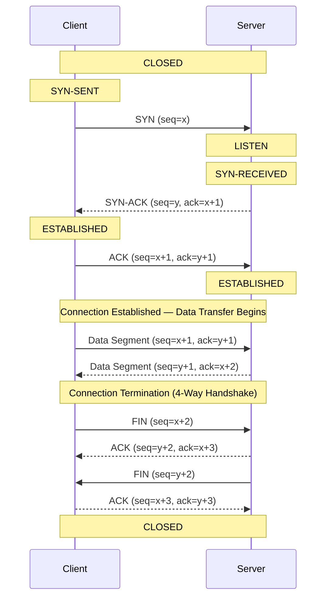

# TCP 3-Way Handshake — Connection Establishment Sequence

The TCP three-way handshake is the process by which a TCP connection is reliably established between a client and a server before any data transfer occurs. The handshake ensures both sides are ready to communicate and synchronizes their sequence numbers. **Step 1 — SYN**: The client sends a TCP segment with the SYN (synchronize) flag set and an initial sequence number (seq=x). The client then enters the SYN-SENT state. **Step 2 — SYN-ACK**: The server, which was in the LISTEN state, receives the SYN and responds with a segment carrying both SYN and ACK flags. It acknowledges the client's sequence number by sending ack=x+1 and provides its own initial sequence number (seq=y). The server moves to the SYN-RECEIVED state. **Step 3 — ACK**: The client receives the SYN-ACK and sends back an ACK segment with seq=x+1 and ack=y+1. Upon sending this, the client enters the ESTABLISHED state. When the server receives the ACK, it also transitions to ESTABLISHED, and the connection is now fully open for bidirectional data transfer. Connection termination uses a four-way handshake with FIN flags, ensuring both sides agree to close gracefully. This handshake mechanism prevents duplicate or delayed packets from previous connections from interfering with new ones, a critical reliability feature of TCP.
