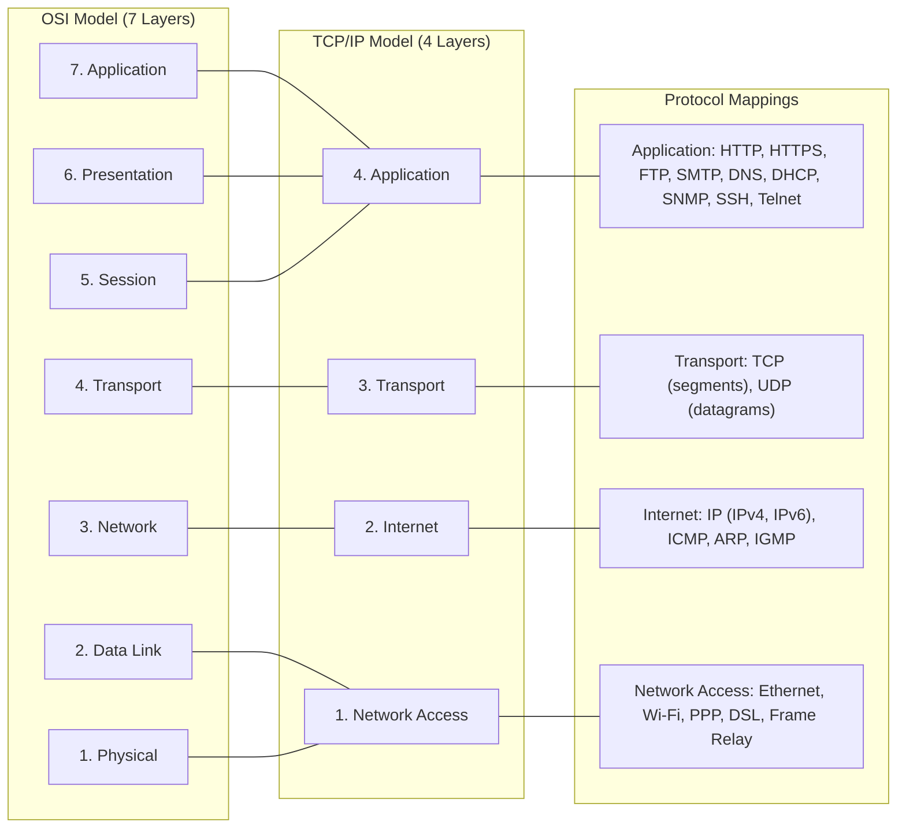

# TCP/IP Model (4-Layer) vs OSI Model with Protocol Mappings

The TCP/IP model is the practical networking framework used by the modern Internet, consisting of four layers that map roughly to the seven-layer OSI model. **Layer 4 (Application)** combines the OSI Application, Presentation, and Session layers into a single layer where high-level protocols like HTTP, FTP, DNS, and SMTP operate. Data is exchanged in messages or streams. **Layer 3 (Transport)** corresponds directly to the OSI Transport layer and handles end-to-end communication using TCP for reliable, connection-oriented delivery and UDP for fast, connectionless delivery. The data unit at this layer is a segment (TCP) or datagram (UDP). **Layer 2 (Internet)** maps to the OSI Network layer and is responsible for logical addressing, routing, and packet forwarding using IP (both IPv4 and IPv6), ICMP for diagnostics, and ARP for address resolution. Data is organized into packets. **Layer 1 (Network Access)** combines the OSI Data Link and Physical layers, handling the physical transmission of data over network hardware such as Ethernet cables, Wi-Fi radios, and DSL modems. The data unit here is a frame. The TCP/IP model is less rigid than OSI and was designed specifically for interoperability across heterogeneous networks, which is why it became the foundation of the Internet.
