# Web Application Architecture — Client to Database Flow

```mermaid
graph LR
    subgraph Client["Browser / Client"]
        C1["User Browser<br/>(Chrome, Firefox, Edge)"]
        C2["Mobile App<br/>(iOS / Android)"]
        C3["API Client<br/>(Postman, curl)"]
        DNS["DNS Resolution → IP"]
    end

    subgraph CDN_Edge["CDN / Edge (Optional)"]
        CDN["Content Delivery Network<br/>Cloudflare, Akamai, AWS CloudFront"]
        CDN_CACHE["Caches static assets<br/>HTML, CSS, JS, images"]
        WAF["Web Application Firewall<br/>(Rate limiting, OWASP rules)"]
    end

    subgraph LB["Load Balancer"]
        LB1["Load Balancer<br/>HAProxy, Nginx, AWS ALB"]
        LB_FUNC["Functions:<br/>1. SSL/TLS termination<br/>2. Traffic distribution (round-robin, least connections)<br/>3. Health checks<br/>4. Sticky sessions (optional)"]
    end

    subgraph Web["Web Server Layer"]
        WS1["Web Server<br/>Nginx / Apache / IIS"]
        WS_FUNC["Serves static files<br/>Reverse proxy to app server<br/>SSL termination<br/>Caching (FastCGI cache)"]
    end

    subgraph App["Application Server"]
        APP1["Application Server<br/>Node.js / Django / Flask / Ruby on Rails / ASP.NET / Spring"]
        APP_FUNC["Business logic execution<br/>Authentication & authorization<br/>Session management<br/>Input validation & sanitization<br/>API endpoint processing"]
    end

    subgraph DB["Database Layer"]
        DB1["Primary Database<br/>PostgreSQL, MySQL, MongoDB"]
        DB2["Cache Layer<br/>Redis, Memcached"]
        DB3["Search Engine<br/>Elasticsearch"]
        DB4["Message Queue<br/>RabbitMQ, Kafka"]
        DB5["File Storage<br/>S3, MinIO, local disk"]
    end

    Client --> CDN_Edge
    CDN_Edge --> LB
    DNS --> CDN_Edge
    LB --> Web
    Web --> App
    App --> DB1
    App --> DB2
    App --> DB3
    App --> DB4
    App --> DB5

    style Client fill:#1a1a2e,color:#fff
    style CDN_Edge fill:#16213e,color:#fff
    style LB fill:#0f3460,color:#fff
    style Web fill:#533483,color:#fff
    style App fill:#e94560,color:#fff
    style DB fill:#2d6a4f,color:#fff
```

A modern web application is built on a multi-tier architecture that separates concerns across several layers for scalability, security, and maintainability. **Client Layer**: The user's browser (or mobile app) initiates the request. DNS resolution translates the domain to an IP address. The browser sends an HTTP/HTTPS request and renders the response. **CDN / Edge (Optional)**: A Content Delivery Network caches static assets geographically close to users, reducing latency. The Web Application Firewall filters malicious requests based on OWASP Top 10 rules and rate limits abuse. **Load Balancer**: The load balancer distributes incoming traffic across multiple web servers for high availability and horizontal scaling. It handles SSL/TLS termination, performs health checks, and optionally maintains sticky sessions. **Web Server Layer**: Nginx or Apache serves static files directly and reverse-proxies dynamic requests to the application servers. It can also cache responses and compress content. **Application Server**: This is where business logic executes. Frameworks like Django, Spring, or Express process requests, validate input, manage sessions, enforce authentication, and query the database. The app server is the primary attack surface for injection flaws, broken authentication, and business logic bugs. **Database Layer**: The primary database (SQL or NoSQL) stores persistent data. Caching layers like Redis reduce database load for frequently accessed data. Search engines like Elasticsearch handle full-text search. Message queues (RabbitMQ, Kafka) decouple services for async processing. File storage (S3, MinIO) holds user uploads and assets. Each layer should be hardened independently — network ACLs, least-privilege database accounts, parameterized queries, and HTTPS at every hop.
