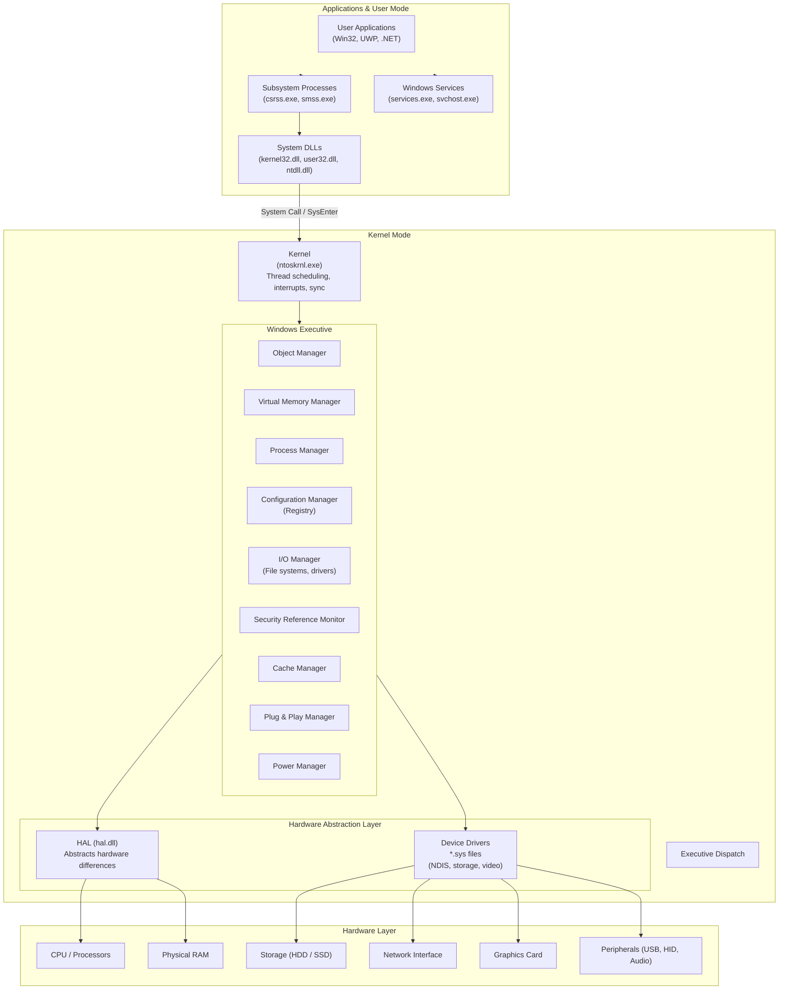

# Windows OS Architecture — Layered System Design

The Windows operating system follows a layered architecture that separates user mode from kernel mode to enforce security and stability. **Hardware Layer**: The physical components — CPU, RAM, storage, network interfaces, and peripherals — form the foundation. **Hardware Abstraction Layer (HAL)**: The HAL (`hal.dll`) abstracts hardware differences so that the kernel and drivers can run uniformly across diverse hardware platforms (x86, x64, ARM). It hides platform-specific details like interrupt controllers and multiprocessor interfaces. **Kernel (`ntoskrnl.exe`)**: The kernel provides core OS functions — thread scheduling, interrupt handling, trap handling, and synchronization. It operates in kernel mode with full access to system memory and hardware. **Windows Executive**: The executive layer implements the core OS services through managers: Object Manager (namespace for resources), Virtual Memory Manager (paging and address translation), Process Manager (thread/process creation), Configuration Manager (Registry), I/O Manager (filesystem and driver I/O), Security Reference Monitor (access control and auditing), Cache Manager, Plug & Play Manager, and Power Manager. **Subsystems**: The Win32 subsystem (`csrss.exe`) provides the traditional Windows API. **User Mode**: Applications, services (`svchost.exe`), and system DLLs (`kernel32.dll`, `user32.dll`) run in user mode with restricted memory access. Transitions to kernel mode occur through system calls via `sysenter`/`syscall` instructions, passing through `ntdll.dll` to the kernel. This layered design ensures that a crash in user mode does not bring down the entire system.
