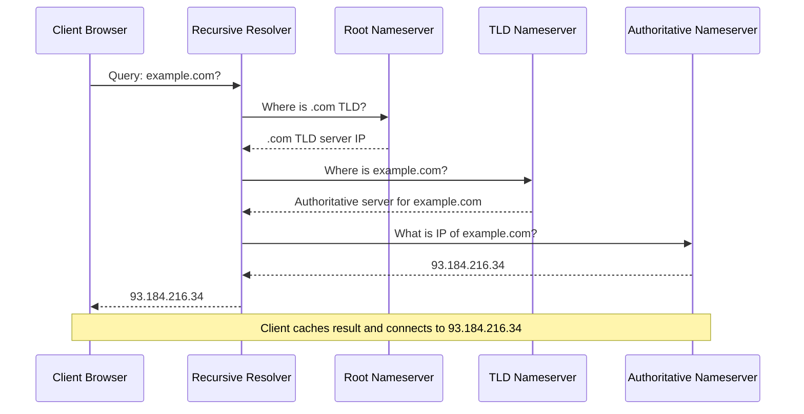

# DNS Resolution

DNS resolution translates human-readable domain names into IP addresses. The client's recursive resolver queries a hierarchy of nameservers—root, TLD (Top-Level Domain), and authoritative—to find the correct IP address, with caching at each level to improve performance.
