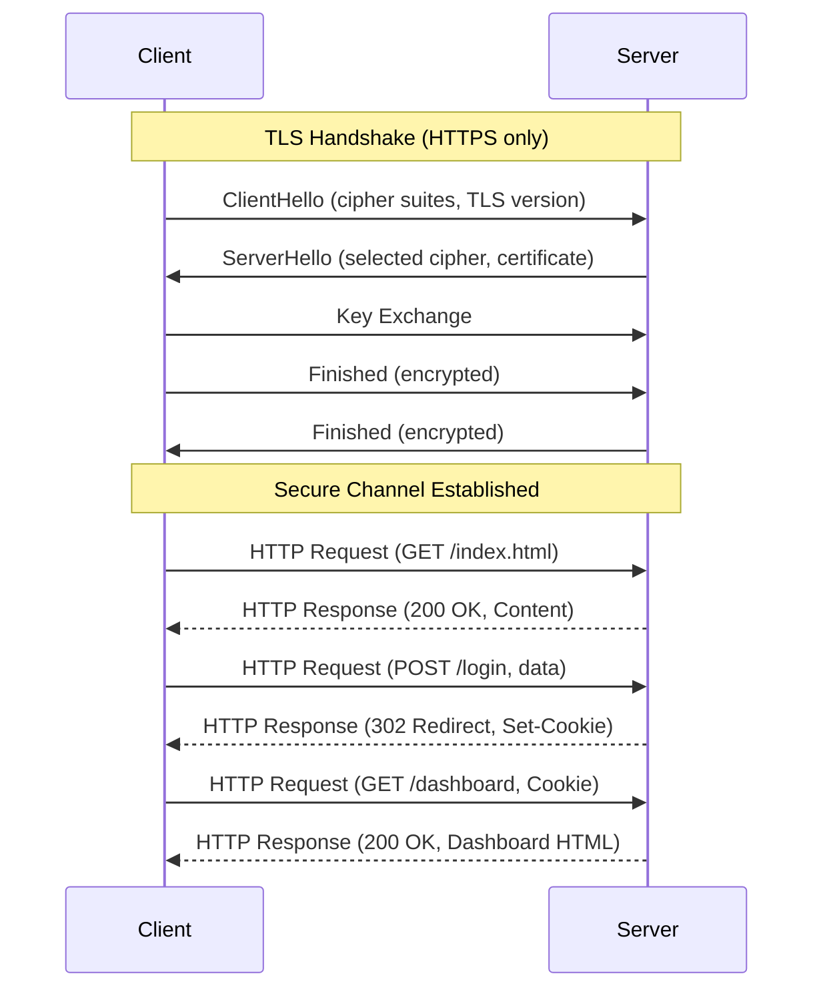

# HTTP/HTTPS Flow

HTTPS requests begin with a TLS handshake to establish an encrypted tunnel, followed by standard HTTP request/response exchanges. Under HTTP, the same request/response pattern occurs without encryption, leaving data vulnerable to interception.
