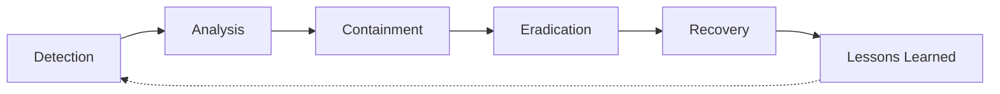

# Incident Response Lifecycle

The incident response lifecycle is a structured approach to handling security incidents. The six phases are: Detection (identifying potential incidents), Analysis (assessing scope and impact), Containment (limiting damage), Eradication (removing the threat), Recovery (restoring normal operations), and Lessons Learned (improving future response).
