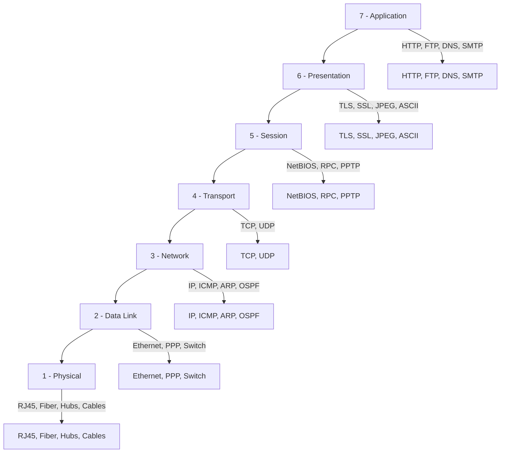

# OSI Model

The OSI (Open Systems Interconnection) model is a conceptual framework used to understand network interactions across seven distinct layers. Each layer provides specific services to the layer above it and receives services from the layer below, enabling standardized communication between diverse systems.
