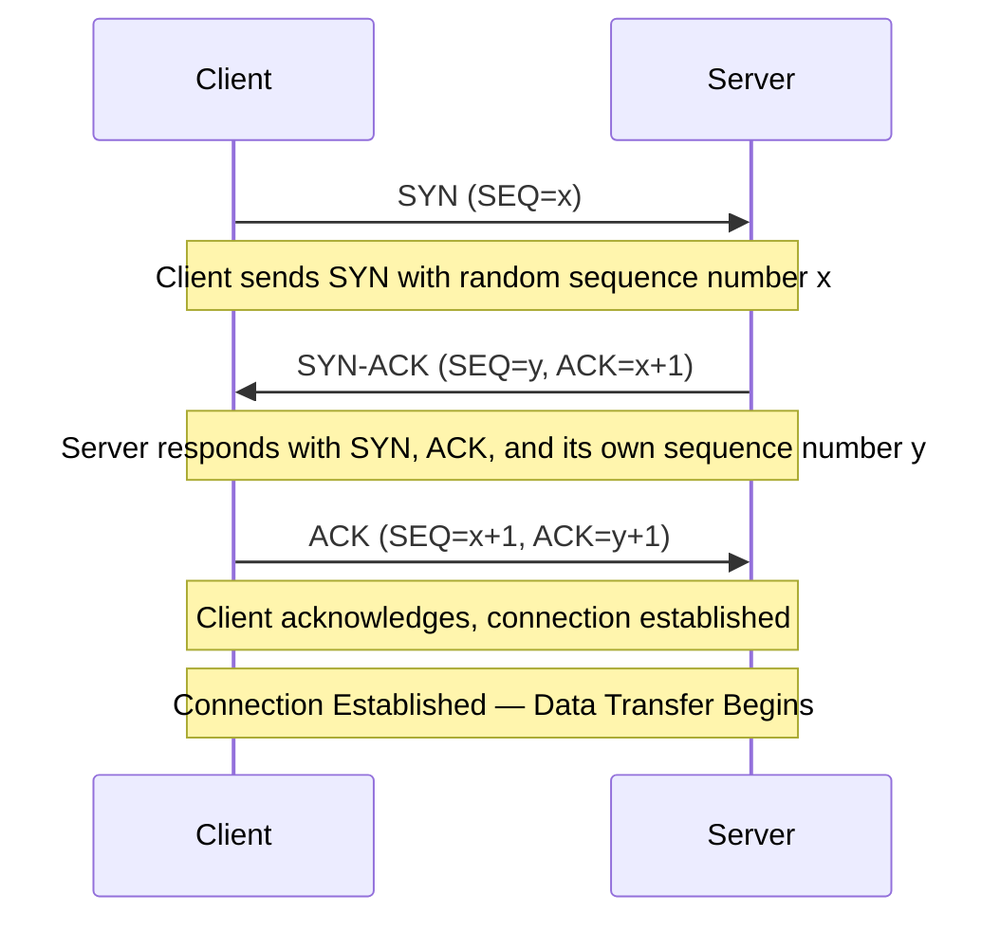

# TCP 3-Way Handshake

The TCP three-way handshake establishes a reliable connection between client and server before data transfer begins. The process involves SYN (synchronize), SYN-ACK (synchronize-acknowledge), and ACK (acknowledge) messages, ensuring both sides are ready to communicate and have agreed on initial sequence numbers.
