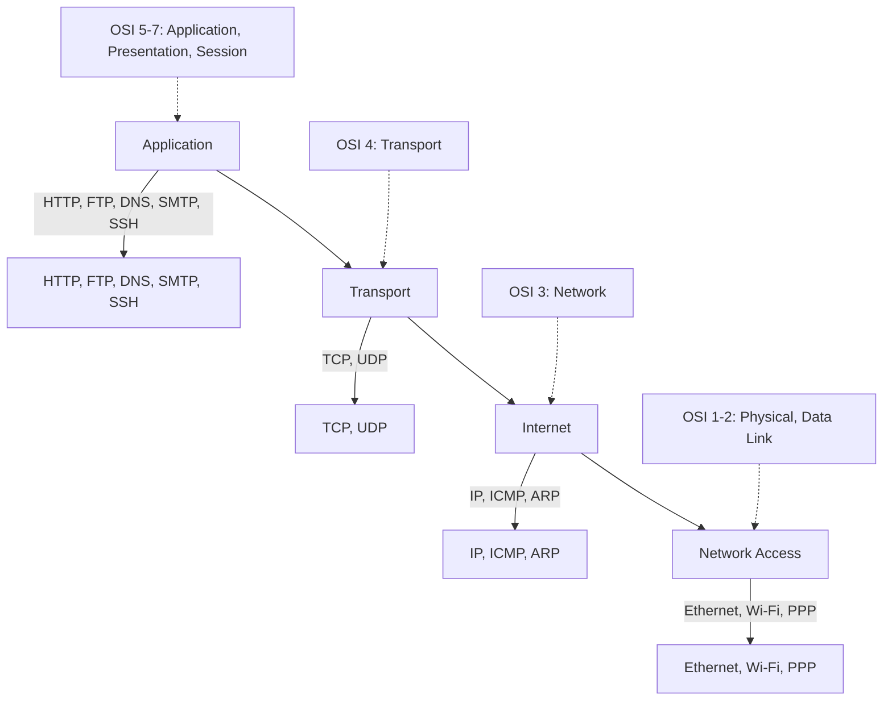

# TCP/IP Model

The TCP/IP model is the practical implementation used by the modern internet. It condenses the OSI model's seven layers into four: Application (combining OSI layers 5-7), Transport (OSI layer 4), Internet (OSI layer 3), and Network Access (OSI layers 1-2).
