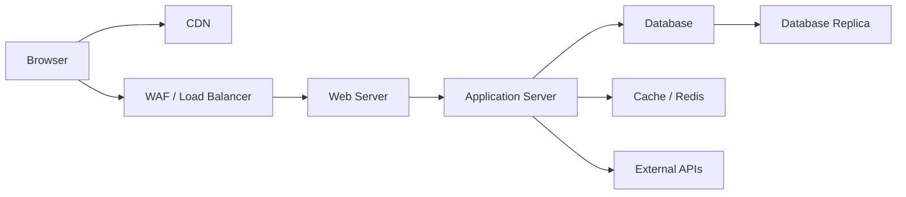

# Web Application Architecture

A typical web application architecture routes requests from the browser through a CDN and load balancer to a web server (e.g., Nginx, Apache), which passes dynamic requests to an application server (e.g., Node.js, Django). The application server queries a database, may cache results, and calls external APIs before returning the response.
